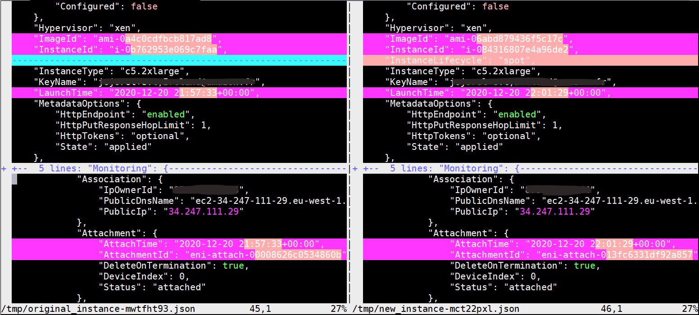

# ec2-spot-converter

This tool converts existing AWS EC2 instances back and forth between **On-Demand** and **'persistent' Spot** billing models while preserving
instance attributes (Launch configuration, Tags..), network attributes (existing Private IP addresses, Elastic IP), storage (Volumes),
Elastic Inference accelerators, Elastic GPUs. 

Others features:
* Can also perform **Spot-to-Spot** and **OnDemand-to-OnDemand** conversions:
	* Allow replacement of existing Spot instances with new "identical" ones to update the instance type and CPU options,
	* Help to fix some Spot instance conditions (Ex: *'IncorrectSpotRequestState Exception'*),
	* Allow Root Disk encryption during conversion.
* Can preserve ELB Target Group instance registrations (disabled by default),
* Can update existing CloudWatch alarms referring the converted Instance Id (disabled by default),

Conversion time ranges from 2 to 5 minutes depending on the instance type.

> **IMPORTANT REMARK**: This tool aims to ease handling of **'Pet'** machines when you have to do so (very frequent after a pure *Lift&Shift*
migration into the Cloud). The author strongly advises to always consider managing resources as **'Cattle'** (with IaC, AutoScaling Groups, Stateless...).
**As a consequence, this tool should be only useful transient while transitionning to [Cloud Native best-practices](https://aws.amazon.com/getting-started/fundamentals-core-concepts/#Performance_Efficiency)**.

# Getting started

**Prerequisistes:**
* Install the tool on an EC2 Linux instance located **in the same account and region than the instance to convert**,

```shell
TOOL_VERSION=`curl https://raw.githubusercontent.com/jcjorel/ec2-spot-converter/master/VERSION.txt`
curl https://raw.githubusercontent.com/jcjorel/ec2-spot-converter/master/releases/ec2-spot-converter-${TOOL_VERSION} -o ec2-spot-converter
chmod u+x ec2-spot-converter
```

* Attach to the EC2 tool instance an IAM role with provided [policy.json](policy.json) file,
* Install Python3 and **boto3** package (with `python3 -m pip install boto3`).

## Convert an On-Demand instance to Spot model

```shell
# Initialize the DynamoDB table that will hold conversion states. **DO IT ONLY ONCE PER REGION AND ACCOUNT**.
$ ./ec2-spot-converter --generate-dynamodb-table
Creating DynamoDB table 'ec2-spot-converter-state-table'...

# Convert running On-Demand instance i-0dadf8589b7ec16f6 to Spot model
#   This instance has 3 attached volumes (w/ one multi-attached 'io1' type), 2 ENIs and 1 EIP.
$ ./ec2-spot-converter --stop-instance --review-conversion-result --instance-id i-0dadf8589b7ec16f6
[STEP 1/21] Read DynamoDB state table...
  => SUCCESS. Record 'i-0dadf8589b7ec16f6' doesn't exist yet.
[STEP 2/21] Discover instance state...
  => SUCCESS. Stopping i-0dadf8589b7ec16f6...
[STEP 3/21] Wait for 'stopped' instance state...
Waiting for instance to stop... (current state=stopping)
Waiting for instance to stop... (current state=stopping)
Waiting for instance to stop... (current state=stopping)
  => SUCCESS. Instance in 'stopped' state.
[STEP 4/21] Tag all resources (Instance, ENI(s), Volumes) with ec2-spot-converter job Id...
  => SUCCESS. Successfully tagged ['i-0dadf8589b7ec16f6', 'eni-092172a81811424d5', 'eni-0f33bc507e00eff48', 'vol-05e7ca553ae156cc3', 'vol-081fc97c000b836b2', 'vol-08792eacd354100cb'].
[STEP 5/21] Get storage volume details...
  => SUCCESS. Successfully retrieved volume details for ['vol-05e7ca553ae156cc3', 'vol-081fc97c000b836b2', 'vol-08792eacd354100cb'].
[STEP 6/21] Detach instance volumes with DeleteOnTermination=False...
Detaching volume vol-081fc97c000b836b2...
Detaching volume vol-08792eacd354100cb...
  => SUCCESS. Detached volumes ['vol-081fc97c000b836b2', 'vol-08792eacd354100cb'].
[STEP 7/21] Wait for volume detach status...
Detected multi-attached volume 'vol-08792eacd354100cb'. Taking care of this special case...
Detected multi-attached volume 'vol-08792eacd354100cb'. Taking care of this special case...
  => SUCCESS. All detached volumes are 'available' : ['vol-081fc97c000b836b2', 'vol-08792eacd354100cb'].
[STEP 8/21] Start AMI creation...
AMI Block device mapping: [{'DeviceName': '/dev/xvda', 'Ebs': {'DeleteOnTermination': True, 'VolumeSize': 8, 'VolumeType': 'gp2'}}]
  => SUCCESS. AMI image ec2-spot-converter-i-0dadf8589b7ec16f6/ami-0f1908293d6fba760 started.
[STEP 9/21] Prepare network interfaces for instance disconnection...
  => SUCCESS. Successfully prepared network interfaces ['eni-092172a81811424d5', 'eni-0f33bc507e00eff48'].
[STEP 10/21] Wait for AMI to be ready...
Waiting for image ami-0f1908293d6fba760 to be available...
Waiting for image ami-0f1908293d6fba760 to be available...
  => SUCCESS. AMI ami-0f1908293d6fba760 is ready.
[STEP 11/21] Checkpoint the current exact state of the instance...
  => SUCCESS. Checkpointed instance state.
[STEP 12/21] Terminate instance...
  => SUCCESS. Successfully terminated instance i-0dadf8589b7ec16f6.
[STEP 13/21] Wait resource release...
  => SUCCESS. All resources released : ['eni-092172a81811424d5', 'eni-0f33bc507e00eff48'].
[STEP 14/21] Create new instance...
  => SUCCESS. Created new instance 'i-06236de813ed5bacd'.
[STEP 15/21] Wait new instance to come up...
  => SUCCESS. Instance i-06236de813ed5bacd is in 'running' state.
[STEP 16/21] Reattach volumes...
Attaching volume vol-081fc97c000b836b2 to i-06236de813ed5bacd with device name /dev/sdb...
Attaching volume vol-08792eacd354100cb to i-06236de813ed5bacd with device name /dev/sdf...
  /!\ WARNING /!\ Volumes attached after boot. YOUR NEW INSTANCE MAY NEED A REBOOT!
  => SUCCESS. Successfully reattached volumes ['vol-081fc97c000b836b2', 'vol-08792eacd354100cb']...
[STEP 17/21] Configure network interfaces...
Setting 'DeleteOnTermination=True' for interface eni-092172a81811424d5...
Setting 'DeleteOnTermination=True' for interface eni-0f33bc507e00eff48...
  => SUCCESS. Successfully configured network interfaces ['eni-092172a81811424d5', 'eni-0f33bc507e00eff48'].
[STEP 18/21] Manage Elastic IP...
  => SUCCESS. Reassociated EIPs '['34.247.111.29']'.
[STEP 19/21] Reboot new instance (if needed and requested)...
  => SUCCESS. It is recommend to reboot 'i-06236de813ed5bacd'... Please specify --reboot-if-needed option next time.
[STEP 20/21] Untag resources...
  => SUCCESS. Successfully untagged ['i-06236de813ed5bacd', 'eni-092172a81811424d5', 'eni-0f33bc507e00eff48', 'vol-081fc97c000b836b2', 'vol-08792eacd354100cb'].
[STEP 21/21] Deregister image... => SKIPPED! Need '--delete-ami' argument.
Conversion successful! New instance id: i-06236de813ed5bacd, ElapsedTime: 112 seconds

/!\ WARNING /!\ Volumes attached after boot. YOUR NEW INSTANCE MAY NEED A REBOOT!
```
If the option `--review-conversion-result` is specified, at conversion end, a **VIm Diff** window pops-up and allow interactive review of the differences between
the original now terminated instance and the newly created one: You should see differences only related to dates, Association Ids, AMI Id (and all volume Ids with 'DeleteOnTermination=True' and the Root volume).



### Convert a Spot instance to On-Demand model

The operation is similar to the Spot model conversion with the difference that the option `--target-billing-model` must be set to `on-demand` explicitly.

> Note: `ec2-spot-converter` can also convert back an instance currently in **Spot interrupted** state to On-Demand model.

### Convert a Spot instance to Spot model to change the instance type and/or CPU Options

`ec2-spot-converter` tool can be used to replace a Spot instance by another one just changing the instance type. This operation is not 
yet possible "in-place" through an AWS EC2 API so the tool will terminate and replace the Spot instance preserving all attributes but
updating the instance type (or CPU options) during the process.

Specify options `--target-instance-type` and/or `--cpu-options`on an existing Spot instance to start conversion. 

### Fix Spot instance with 'IncorrectSpotRequestState Exception'

The tool is able to fix '*IncorrectSpotRequestState Exceptions*' due to the Spot request been cancelled by the user but the Spot instance was
left running. This kind of instance may suffer some unexpected behaviors like no possibility to stop them anymore.

The tool can be used to recreate a new healthy Spot instance from the problematic Spot instance.

Simply call `ec2-spot-converter` with the problematic Instance Id and specify options --target-billing-model 'spot'
**and --do-not-require-stopped-instance** (as the instance can not be stopped).

> It is recommended to perform a System stop (so **NOT a System reboot**) on the guest Operating System to switch Read-Only
all volumes and ensure Filesystem data consistency. On a Linux guest, usually, the Linux command `halt` will stop the Operating
System safely and won't reboot immediatly: Please ensure that the message `"reboot: System halted."` is displayed on the guest
console thanks to AWS Console screenshot feature. 

### Encrypt Root Disk during conversion

The tool can be used to encrypt the Root Disk (and more generally, all volumes marked with attribute *DeleteOnTermination=True* that will be part of the 
Backup AMI).

Simply specify option `--volume-kms-key-id` with a valid KMS Key Id and all volumes part of the Backup AMI will be encrypted in the new instance. 
If a volume is already encrypted, it will be left as-is just generating a warning.

Ex:

	--volume-kms-key-id arn:aws:kms:eu-west-1:111111111111:key/22222222-3333-4444-5555-666666666666

If you want to convert **Spot-to-Spot** or **OnDemand-to-OnDemand**, specify `--force` option as well.

### Preserve ELB target group registrations

The tool can preserve the target group registrations of the converted instance. As the conversion is based on the termination of the specified
instance Id, all references in target groups of this instance Id must be updated with the new instance Id created during the conversion.

The feature is enabled by setting option `--check-targetgroups` with either a list of target group ARNs to inspect or 
no parameter which means all target groups in the account and
region. **As an AWS account can contain up to 3000 target groups and induce long processing times, the feature is disabled by default**.

Optionally, the tool can wait, at end of conversion, for the newly created instance to reach one of specified health states in 
all participating target groups.
Specify `--wait-for-tg-states` setting without argument to wait for the `["unused", "healthy"]` states or provide a list of expected target group states 
(ex: specify both `unhealthy` and `healthy` to exit from the tool after the `initial` phase even in case of failure to pass health checks).

### Update CloudWatch Alarms referring the converted Instance Id

After a conversion, by default, all existing CloudWatch alarms, that refer to the original converted instance Id,
become stale because pointing on a metric associated to a terminated instance Id.

This behavior can be changed by requesting the tool to update these CloudWatch alarms with the new Instance Id value.

Specify `--update-cw-alarms` optionally with arguments:
* When no argument is specified (or `'*'`), all existing CloudWatch alarms in the current account will be searched for instance id reference,
* When arguments are specified, they are used as CloudWatch alarm prefixes to filterin only a subset of existing alarms (=faster processing). Ex:
`--update-cw-alarms Frontend Backend` will filterin all CloudWatch alarm names that start with either `Frontend` or `Backend`strings.

**Only alarms referring to a metric with a dimension named `InstanceId` and the value of the converted Instance Id will be updated.**

As an AWS account can contain thousands of CloudWatch alarms, this feature is disabled by default.

# Command line usage

```
usage: ec2-spot-converter [-h] -i INSTANCE_ID [-m {spot,on-demand}]
                          [-t TARGET_INSTANCE_TYPE] [--ignore-userdata]
                          [--ignore-hibernation-options]
                          [--cpu-options CPU_OPTIONS]
                          [--max-spot-price MAX_SPOT_PRICE]
                          [--volume-kms-key-id VOLUME_KMS_KEY_ID] [-s]
                          [--reboot-if-needed]
                          [--update-cw-alarms [UPDATE_CW_ALARMS [UPDATE_CW_ALARMS ...]]]
                          [--delete-ami]
                          [--check-targetgroups [CHECK_TARGETGROUPS [CHECK_TARGETGROUPS ...]]]
                          [--wait-for-tg-states [{unused,unhealthy,healthy,initial,draining} [{unused,unhealthy,healthy,initial,draining} ...]]]
                          [--do-not-require-stopped-instance] [-r]
                          [--dynamodb-tablename DYNAMODB_TABLENAME]
                          [--generate-dynamodb-table] [-f]
                          [--do-not-pause-on-major-warnings]
                          [--reset-step RESET_STEP] [-d] [-v]

EC2 Spot converter

optional arguments:
  -h, --help            show this help message and exit
  -i INSTANCE_ID, --instance-id INSTANCE_ID
                        The id of the EC2 instance to convert.
  -m {spot,on-demand}, --target-billing-model {spot,on-demand}
                        The expected billing model after conversion. Default:
                        'spot'
  -t TARGET_INSTANCE_TYPE, --target-instance-type TARGET_INSTANCE_TYPE
                        The expected instance type (ex: m5.large...) after
                        conversion. This flag is only useful when applied to a
                        Spot instance as EC2.modify_instance_attribute() can't
                        be used to change Instance type. Default:
                        <original_instance_type>
  --ignore-userdata     Do not copy 'UserData' on converted instance.
  --ignore-hibernation-options
                        Do not copy 'HibernationOptions' on converted
                        instance.
  --cpu-options CPU_OPTIONS
                        Instance CPU Options JSON structure. Format:
                        {"CoreCount":123,"ThreadsPerCore":123}. Note: The
                        special 'ignore' value will force to not define the
                        CPUOptions structure in the new EC2 Launch
                        specification.
  --max-spot-price MAX_SPOT_PRICE
                        Maximum hourly price for Spot instance target.
                        Default: On-Demand price.
  --volume-kms-key-id VOLUME_KMS_KEY_ID
                        Identifier (key ID, key alias, ID ARN, or alias ARN)
                        for a Customer or AWS managed KMS Key used to encrypt
                        the EBS volume(s). Note: You cannot specify 'aws/ebs'
                        directly, please specify the plain KMS Key ARN
                        instead. It applies ONLY to volumes placed in the
                        Backup AMI *AND* not already encrypted.
  -s, --stop-instance   Stop instance instead of failing because it is in
                        'running' state.
  --reboot-if-needed    Reboot the new instance if needed.
  --update-cw-alarms [UPDATE_CW_ALARMS [UPDATE_CW_ALARMS ...]]
                        Update CloudWatch alarms with reference to the
                        converted Instance Id. Optionnaly, a CloudWatch alarm
                        name prefix list can be supplied to narrow instance id
                        lookup to a subset of matching alarm names. Without
                        args, all CloudWatch alarms in the current account
                        will be searched.
  --delete-ami          Delete AMI at end of conversion.
  --check-targetgroups [CHECK_TARGETGROUPS [CHECK_TARGETGROUPS ...]]
                        List of target group ARNs to look for converted
                        instance registrations. Without parameter specified,
                        it means all ELB target groups in the current region
                        (WARNING: An account can contain up to 3000 target
                        groups and induce long processing time). Default:
                        Feature is disabled when option is not on the command
                        line.
  --wait-for-tg-states [{unused,unhealthy,healthy,initial,draining} [{unused,unhealthy,healthy,initial,draining} ...]]
                        Wait for target group registrations to reach specified
                        state(s) at end of conversion. Default: ['unused',
                        'healthy']
  --do-not-require-stopped-instance
                        Allow instance conversion while instance is in
                        'running' state. (NOT RECOMMENDED)
  -r, --review-conversion-result
                        Display side-by-side conversion result. Note: REQUIRES
                        'VIM' EDITOR!
  --dynamodb-tablename DYNAMODB_TABLENAME
                        A DynamoDB table name to hold conversion states.
                        Default: 'ec2-spot-converter-state-table'
  --generate-dynamodb-table
                        Create a DynamoDB table to hold conversion states.
  -f, --force           Force to start a conversion even if the tool suggests
                        that it is not needed.
  --do-not-pause-on-major-warnings
                        Do not pause on major warnings. Without this flag, the
                        tool waits 10 seconds to let user read major warnings.
  --reset-step RESET_STEP
                        (DANGEROUS) Force the state machine to go back to the
                        specified processing step.
  -d, --debug           Turn on debug traces.
  -v, --version         Display tool version.
```

> At the end of a conversion, the tool can replay as many times as wished former conversion results specifying the original instance id: It will display again all execution steps and it can be useful to review again the conversion result (VIm Diff window) of a previous run. The `--delete-ami` option can also be added in a subsequent call to suppress the AMI and associated snapshots built by a previous tool execution.

## Note about converted instance termination

One must keep in mind that Spot instances have a different life cycle than On-Demand ones. `ec2-spot-converter` takes care of most of the differences but
can not hide some. Especially, terminating a Spot instance may have unexpected consequence: If you terminate a Spot instance without prior-canceling of the
associated request, a new fresh Spot will be automatically launched by EC2. **In order to prevent this behavior, it is advised to convert back a Spot to 
On-Demand as a pre-requisite to instance termination**.


## Resilience 

The tool is designed with maximum safety of stateful data and operations in mind: All conversion states are persisted in a DynamoDB table and, if the tool is interrupted or
encounters an error, it should be restartable where it went interrupted without special user action. In the unexpected (and unlikely) event of a major bug and bad outcome, 
please consult the DynamoDB line corresponding to your instance Id: This line contains JSON states of your original instance and other information (AMI, Interfaces...)
allowing to reconstruct the original instance by hand. **In such event, please also create a GitHub issue with a precise description of the encountered problem and so help improving the tool!**

> **BE CAREFUL ABOUT AUTOMATIC REMEDIATIONS CONFIGURED IN YOUR LANDING-ZONE!** That's good practice to enable periodic checks in a LZ to 
enforce a known state of your EC2 resources (ex: compliant tagging, delete unattached Security Groups or EBS volumes etc...). Some ec2-spot-converter 
users encountered failed conversions or non-identical resulting EC2 induced by these LZ remediation mecanisms that altered resources 
during conversion. **In order to avoid such issues, ec2-spot-converter tags all converted ressources with '*ec2-spot-converter:job-id*' 
(with value set to {instance-id}). Thanks to this transient tag, LZ remediation mecanisms should be modified to detect and ignore safely
ressources under conversion.**

## Contributing

If you'd like to contribute, please fork the repository and use a feature
branch. Pull requests are warmly welcome.

### Contributor credits (Thank you!):

* @regevbr: Contributed ELB target group registration preservation.

## Licensing

The code in this project is licensed under [MIT license](LICENSE).

